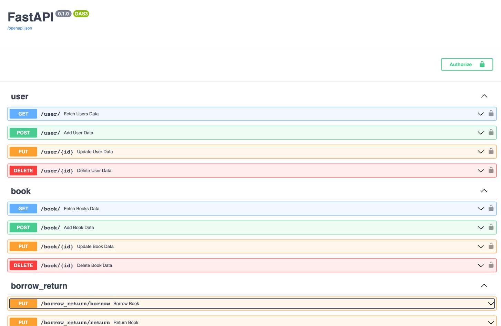
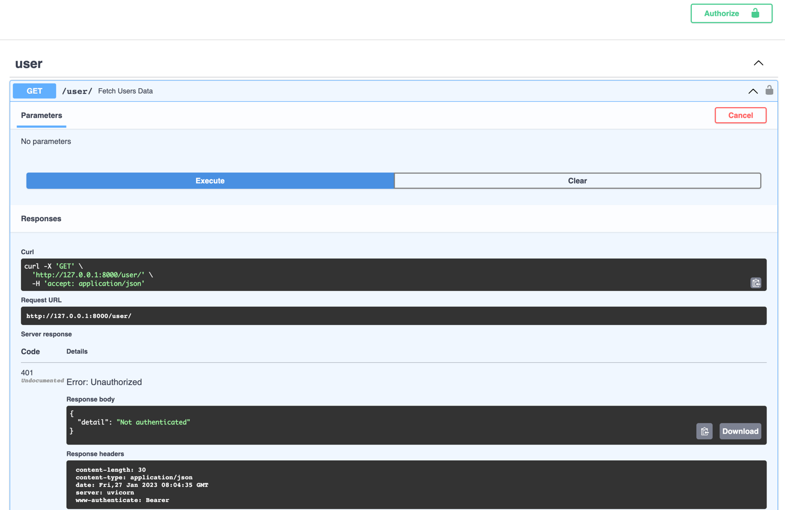
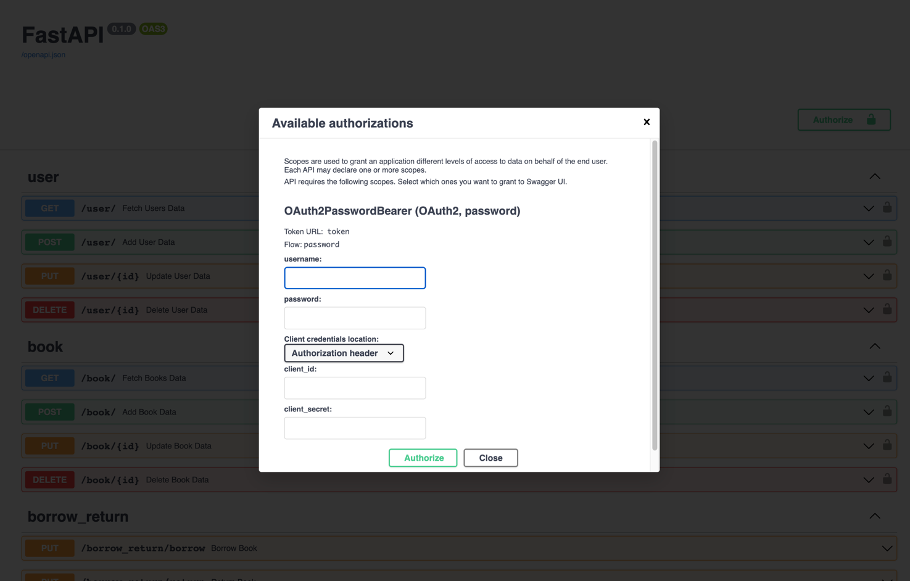
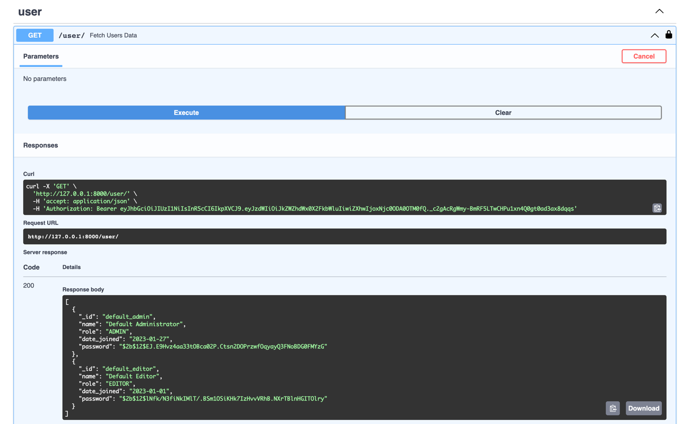

# GovTech Vica Engineering Assessment
Attempted by: Lee Chen Yuan

## Prerequisites
* This project uses MongoDB Community Edition on macOS (installation instructions can be found [here](https://www.mongodb.com/docs/manual/tutorial/install-mongodb-on-os-x/)).
* This project is built using Python 3.10.
* Install the project dependencies (recommended to perform this inside a virtual environment):
  ```
  pip install -r requirements.txt
  ```

## Getting Started
1. [Run MongoDB Community Edition](https://www.mongodb.com/docs/manual/tutorial/install-mongodb-on-os-x/#run-mongodb-community-edition)
   * For instance, to run MongoDB as a macOS service, run:
     ```
     brew services start mongodb-community@6.0
     ```
2. If this is your first time running this project, run the `recreate_default_admin.py` script to create a default admin user in the database.
   ```
   python recreate_default_admin.py
   ```
   * This admin user has `_id="default_admin"` and `password="secret"`
   * You may also run this script in case you forget the password of all admin users, or in case you accidentally deleted all admin users.
3. Start the FastAPI server by running `main.py`
   ```
   python main.py
   ```

## User Manual
* Go to `http://127.0.0.1:8000/docs` and you should see the following:
    
* If you try to perform a privileged action (e.g. add user, delete book), you will get a `401 Error: Unauthorized`.
    
* To perform privileged actions, you will need to log in (assuming your user has the required privileges) by clicking on the green `Authorize` button located in the top-right corner of the page. Clicking on it will produce the following:
    
  * Key in the username and password then hit the `Aurthorize` button. Note that username refers to `_id` of the user. For instance, the default admin user's username is `default_admin` and password is `secret`.

### User CRUD
* All `/user` endpoints require you to be logged in as an admin.
* Create users, one at a time, using the POST endpoint.
* Retrieve all users using the GET endpoint:
  
    * Note that user passwords are first hashed before being inserted into the DB.
* Update users, one at a time, using the PUT endpoint. The user ID (`_id`) is required to perform this action.
* Delete users, one at a time, using the DELETE endpoint. Similar to update, the user ID (`_id`) is required to perform this action.

### Book CRUD
* All `/book` endpoints require you to be logged in as either an admin or an editor.
* Create books, one at a time, using the POST endpoint.
* Retrieve all books using the GET endpoint
* Update books, one at a time, using the PUT endpoint. The book ID (`_id`) is required to perform this action.
* Delete books, one at a time, using the DELETE endpoint. Similar to update, the book ID (`_id`) is required to perform this action.

### Borrow/Return
* Any user is able to run the `/borrow_return` endpoints
* To borrow a book, a user has to provide both their user `_id` and the book `_id`. A copy of a book can only be borrowed if the book's `BorrowingAvailabilityStatus` is `AVAILABLE`. Furthermore, each user is only allowed to borrow 1 copy of each book at any point in time. 
* Similarly, to return a book, a user has to provide both their user `_id` and the book `_id`.

### To shut down the service:
  * Terminate the FastAPI service
  * [Stop MongoDB](https://www.mongodb.com/docs/manual/tutorial/install-mongodb-on-os-x/#run-mongodb-community-edition)
    * For instance, to stop MongoDB from running as a macOS service, run:
      ```
      brew services stop mongodb-community@6.0
      ```

## Assumptions
* A book's `BorrowingAvailabilityStatus` is True as long as there is at least 1 copy that has not been borrowed.
* Each user is only allowed to borrow 1 copy of each book at any point in time.

## Project Structure
This project is structured into 4 main components:
1. Data models (`/models` directory)
   * `models/user.py` contains the user schema which Pydantic uses to ensure that users are created with the necessary fields. A Pydantic validator is further used to hash the passwords so that passwords do not exist as plaintext in the DB.
   * `models/book.py` contains the book schema. Similarly, Pydantic is used to ensure that books are created with necessary fields.
2. Routes (`/routes` directory)
   * Each router allows related endpoints to be grouped together for improved organization and maintainability.
   * For instance, `routes/user.py` contains all 4 CRUD endpoints pertaining to users.
   * Next, in `app.py`, the following code is used to enforce that only logged in admin users can query these `/user` endpoints: 
     ``` python
     app.include_router(router=user.router, dependencies=[Depends(user_is_admin)])
     ```
   * Similarly, `routes/book.py` contains all 4 CRUD endpoints pertaining to books, and have the following code in `app.py` to enforce that only logged in admin/editor users can query these `/book` endpoints:
     ``` python
     app.include_router(router=book.router, dependencies=[Depends(user_is_editor)])
     ```
3. Database functions (`database.py`)
   * This file contains DB connection details.
   * The `motor` package to interact with MongoDB asynchronously
   * This file also contains all the code which interacts with the DB collections directly, such as `users_collection.find_one({"_id": user_id})`
4. Authentication functions (`authentication.py`)
   * This file contains logic pertaining to authenticating users so that privileged actions (e.g. creating user, deleting book) can only be performed by users with necessary permissions.
   * It uses OAuth2 and JWT tokens.

## Scalability of Project
* Before this project is even productionized, it should be more rigorously tested. We should have unit tests for all the endpoints, with varying input data types. There should also be tests to ensure that users without the necessary permissions aren't able to perform privileged actions.
* To support more users and higher volumes of traffic, we could horizontally scale the system with the help of Docker and Kubernetes. This would allow us to have multiple pods running at the same time to serve more traffic per unit time.
* To scale out the DB, we could use a managed service like MongoDB Atlas to ensure that the DB could support higher traffic volumes.

## References
* [Building a CRUD App with FastAPI and MongoDB](https://testdriven.io/blog/fastapi-mongo/#mongodb)
* [OAuth2 with Password (and hashing), Bearer with JWT tokens](https://fastapi.tiangolo.com/tutorial/security/oauth2-jwt/)
* [Bigger Applications - Multiple Files](https://fastapi.tiangolo.com/tutorial/bigger-applications/#bigger-applications-multiple-files)